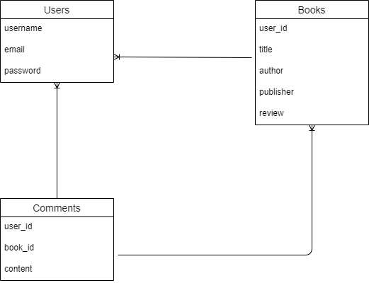
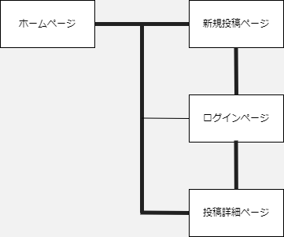

アプリケーション名	 
BOOKMAN

アプリケーション概要  
読書家同士が本を読んだ後の本の内容について、
意見を交換し合うための交流の場を提供するアプリケーションです。  
読書を個人の経験だけのものにせずに、
本を読んで感じたことや考えたことを他者と共有することでユーザー同士が刺激し合い読書からの学びをさらに深めあうことを目的に開発しました。

URL
https://bookman-u28r.onrender.com

テスト用アカウント	

Basic認証パスワード:3333  
Basic認証ID        :admin  
メールアドレス     :yamashita@tatuya  
パスワード         :tatuya12345

利用方法	

・投稿内容の閲覧  
一覧画面に標示されている各投稿内容の「書評を読む」をクリック  
投稿詳細ページに遷移するので、書評とそのコメントを閲覧する

・読書に関する意見の投稿   
ヘッダー「新規登録」をクリックし、
名前・メールアドレス・パスワードを入力（※既存ユーザー情報にてログインでも可能）  
ログイン後「新規投稿」がヘッダーに標示されるのでクリックし、
各項目を記載し「投稿」をクリック

・他のユーザーの投稿に対するコメント投稿  
ヘッダー「新規登録」をクリックし、名前・メールアドレス・パスワードを入力（※既存ユーザー情報にてログインでも可能）  
「書評を読む」をクリックし、詳細画面の新規コメント入力欄にコメントを入力後、
「コメント投稿」をクリック

アプリケーションを作成した背景  
読書は様々な深い知見を得ることが出来ますが、
対面でのコミュニケーションでは他者と深身のある意見交換がなかなか出来ません。
書籍を読むことで得られた深みのある知見を交換しあう場をオンライン上に構築することによって、
様々な読書家同士が教養を高めあえることが出来るようにアプリケーションを開発しました。

実装予定の機能  
・編集機能  
・ユーザー招待機能

データベース設計

画面遷移図

開発環境	使用した言語  
・フロントエンド :HTML CSS Bootstrap  
・バックエンド   :Ruby  
・フレームワーク :Ruby on Rails

改善点	
読書家同士のコミュニケーションを目的としたアプリという軸があるため、
投稿内容に不適切な内容のコメントや投稿をユーザーにさせないような機能を実装するとさらにアプリケーションとしてのクオリティーが向上すると感じます。
例：通報機能  コメント投稿に一定以上の文章量が無いと投稿できないようにする。

制作時間	4日 2024/05/13時点